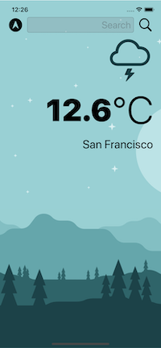
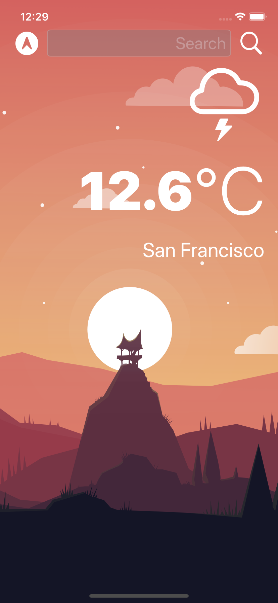
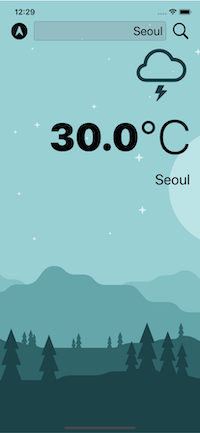
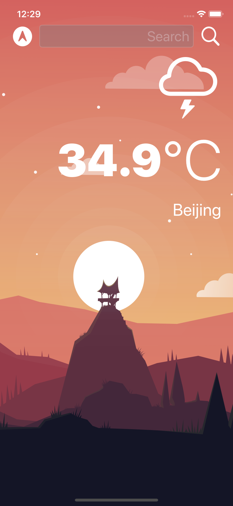

#  Clima

A dark-mode enabled weather app. You'll be able to check the weather for the current location based on the GPS data from the iPhone as well as by searching for a city manually. 

* Dark-mode enabled 
* Vector images as image assets.
* UITextField to get user input. 
* Delegate pattern.
* Swift protocols and extensions. 
* Swift guard keyword. 
* Swift computed properties.
* Swift closures and completion handlers.
* Use URLSession to network and make HTTP requests.
* Parse JSON with the native Encodable and Decodable protocols. 
* Use Grand Central Dispatch to fetch the main thread.
* Use Core Location to get the current location from the phone GPS. 

